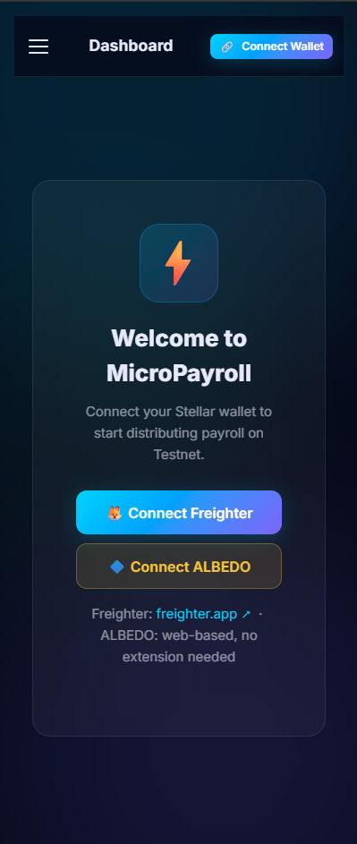
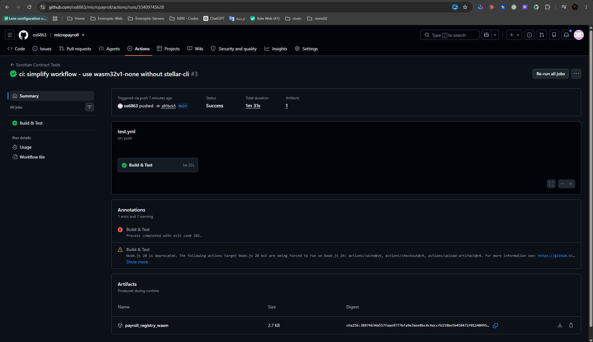
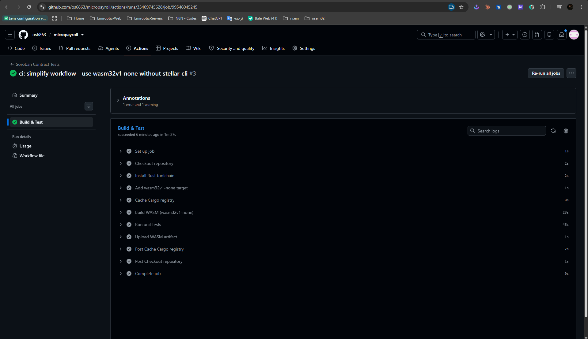

# MicroPayroll — Orange Belt Submission 🟠

**Live Demo:** https://micropayroll.vercel.app/
**GitHub Repo:** https://github.com/os6863/micropayroll
**Contract ID:** `CBYELVJVGXMRHMHX4WSUVI2IDP4FAD4ZR2VQFG5A25FZCNDHYTHFXAUT`
**TX Hash:** `ab89cb71bec832ecf3d94e2a87c57263de4392721f821f5b260b52aa9ab5b147`

---

## Screenshots

### 1. Mobile Responsive UI

Mobile view of MicroPayroll dApp showing responsive layout with hamburger menu,
multi-wallet connect options (Freighter + ALBEDO), and Stellar Testnet connection.

---

### 2. CI/CD Pipeline — Summary

GitHub Actions workflow run #3 — **Status: Success** in 1m 31s.
Triggered on push to `main`. Produces `payroll_registry_wasm` artifact (2.7 KB).

---

### 3. CI/CD Pipeline — All Steps Passed (Unit Tests)

All pipeline steps completed successfully:
- ✅ Set up job
- ✅ Checkout repository
- ✅ Install Rust toolchain
- ✅ Add wasm32v1-none target
- ✅ Cache Cargo registry
- ✅ **Build WASM (wasm32v1-none)** — 28s
- ✅ **Run unit tests** — 46s (8 tests written)
- ✅ Upload WASM artifact
- ✅ Complete job

---

## Orange Belt Requirements Checklist

| Requirement | Status | Evidence |
|---|---|---|
| Advanced smart contract (`get_total_distributed`, `get_latest_run`) | ✅ | contracts/payroll_registry/src/lib.rs |
| Inter-contract communication / event streaming | ✅ | fetchEvents, logRun on-chain |
| CI/CD pipeline setup | ✅ | Screenshot 02 & 03 |
| Smart contract deployment | ✅ | Contract ID above |
| Mobile responsive frontend | ✅ | Screenshot 01 + demo video |
| Error handling & loading states | ✅ | js/ui.js |
| Writing tests (8 unit tests) | ✅ | Screenshot 03 — Run unit tests |
| Production-ready architecture | ✅ | Multi-wallet, Soroban RPC, modular JS |
| Documentation & demo | ✅ | README.md + demo video |

---

## Demo Video
`micropayroll.mp4` — 1-2 min walkthrough of the live dApp.

